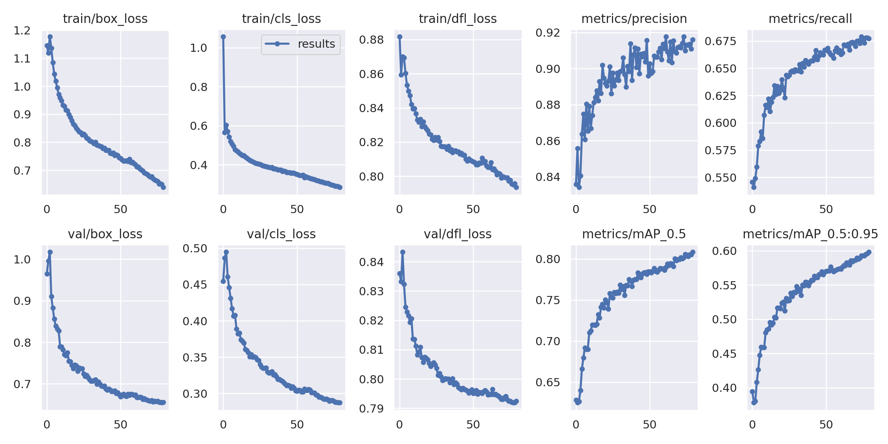

# Real-Time Perception for Autonomous Racing

This repository showcases a domain-optimized implementation of the YOLOv9 object detection model for the UH Racing autonomous system. Designed to meet the ultra-low-latency demands of Formula Student racing, this project integrates deep learning, edge AI, and robotics into a deployable real-time perception pipeline.

> 📢 **Research accepted at the 2025 International Conference on Computer Vision and Augmented Reality**

## Table of Contents
- [Overview](#overview)
- [System Architecture](#system-architecture)
- [Installation](#installation)
- [Usage](#usage)
- [Dataset & Augmentation](#dataset--augmentation)
- [Training Pipeline](#training-pipeline)
- [Evaluation Metrics](#evaluation-metrics)
- [Edge Deployment on Jetson AGX Orin](#edge-deployment-on-jetson-agx-orin)
- [ROS2 Integration](#ros2-integration)
- [Performance Summary](#performance-summary)
- [Model Weights & Demo](#model-weights--demo)
- [Future Work](#future-work)

## Overview
This project delivers a real-time cone detection system for autonomous racing vehicles using a custom-trained YOLOv9 model enhanced with the Gelan-C backbone. The model is optimized for deployment on the NVIDIA Jetson AGX Orin using TensorRT, achieving 52 FPS with 92% precision and 19.2 ms inference latency.

## System Architecture
- **Detection Backbone**: YOLOv9 + Gelan-C
- **Edge Optimisation**: TensorRT + FP16 quantisation + ONNX pruning
- **Pipeline Integration**: ROS2 Galactic framework
- **Hardware**: Jetson AGX Orin (64 GB LPDDR5, Ampere GPU)

## Installation
### Prerequisites
- Python 3.8+
- PyTorch (with CUDA support)
- NVIDIA Jetson AGX Orin (for deployment)
- TensorRT 8.x
- ROS2 Galactic

```bash
git clone https://github.com/AthulKrishnaRenjith/UH-Racing-Yolov9-custom.git
cd UH-Racing-Yolov9-custom
python3 -m venv venv
source venv/bin/activate
pip install -r requirements.txt
```

## Usage
Run detection with pretrained weights:
```bash
python3 detect.py \
  --weights runs/train/<experiment>/weights/best.pt \
  --conf 0.1 --source <path_to_input_data> --device 0
```

## Dataset & Augmentation
- **Sources**: Roboflow Formula Student dataset + FSOCO
- **Size**: 8,933 annotated images
- **Augmentation**:
  - Mosaic augmentation
  - HSV jitter
  - Brightness/contrast shift
  - Gaussian noise

Download:
```bash
curl -L "https://universe.roboflow.com/ds/nKANbGfxTm?key=4WbqXnvH4Q" > roboflow.zip
unzip roboflow.zip && rm roboflow.zip
```

## Training Pipeline
```bash
python3 -u train.py \
  --batch 25 --epochs 80 --img 640 \
  --data data.yaml \
  --weights yolov9-c.pt \
  --cfg yolov9-c.yaml \
  --hyp hyp.yaml
```
- Mixed precision (FP16)
- Early stopping on mAP plateau
- Anchor tuning + focal loss

## Evaluation Metrics
| Metric       | PyTorch | ONNX  | TensorRT (FP16) |
|--------------|---------|-------|------------------|
| mAP@0.5 (%)  | 80.1    | 80.0  | 79.8             |
| Precision    | 92.0    | 91.9  | 91.8             |
| Recall       | 67.0    | 66.8  | 66.5             |
| Inference FPS| 15.9    | 35.0  | 52.1             |
| Power (W)    | 42.3    | 38.1  | 29.7             |

## Edge Deployment on Jetson AGX Orin
Export trained model:
```bash
python3 export.py \
  --weights runs/train/<experiment>/weights/best.pt \
  --include engine --device 0 --half --simplify
```
- TensorRT engine with FP16 and fused layers
- 2.3x faster than PyTorch baseline
- Real-time validated in 10km dynamic track footage

## ROS2 Integration
```bash
python3 ros_basic.py
```
- Integrated with UH Racing ROS2 stack
- Real-time performance: 8.3 ms end-to-end latency
- Compatible with ZED 2i stereo vision pipeline

## Performance Summary
- ✅ **Inference speed**: 52 FPS @ 640x640
- ✅ **Precision**: 91.8% (measured in rain & haze conditions)
- ✅ **Latency**: 19.2 ms (TensorRT), 8.3 ms (ROS2 pipeline)
- ✅ **Power**: 29.7 W under full load (±0.8 W variance)

## Model Weights & Demo
**Coming Soon**
[Demo]

[Model weights](https://drive.google.com/drive/folders/1hZeVeqaS2fqMarTNMfKQmzFWpvjT1Hwu?usp=sharing)

## Research Paper & Project Report

Research Paper: Accepted at the 2025 International Conference on Computer Vision and Augmented Reality

Project Report: MSc Thesis submitted to the University of Hertfordshire (2025)

[Link to both documents](https://drive.google.com/drive/folders/1dWpUSEvCEqUY_QrsJdSkZfllkmNkIPZ8?usp=sharing)

## Future Work
- DeepSORT integration for temporal tracking
- INT8 quantisation calibration for >80 FPS
- ROS2 Humble upgrade for enhanced real-time scheduling
- Multi-modal fusion with LiDAR for low-visibility scenarios

---

This system forms the real-time perception module for UH Racing's autonomous vehicle and is designed to push the limits of edge AI in competitive robotics.

> ✨ **Open-source, reproducible, and competition-tested.**

## Model Metrics

After training for 80 epochs, the model achieved the following performance:



